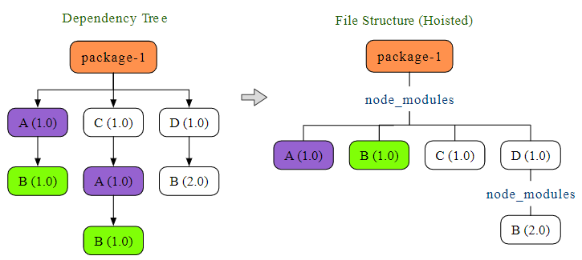
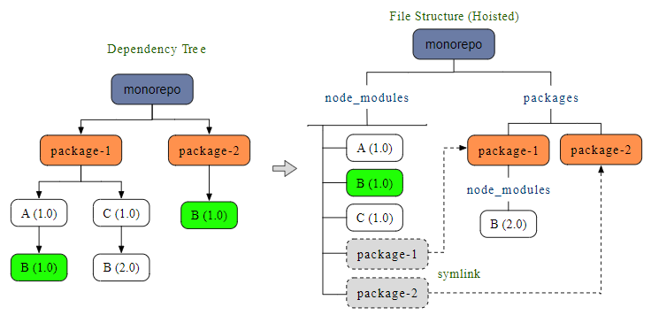
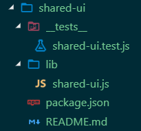

# Monorepos with Yarn and Lerna

This document is a collection of facts and observation re. Lerna and Yarn Workspaces. The text pieces come from different articles and from my personal experience.

## Workspaces hoisting explained

### Hoisting without workspaces



### Hoisting with workspaces



### Nohoist

__nohoist__ enables workspaces to consume 3rd-party libraries not yet compatible with its hoisting scheme. The idea is to disable the selected modules from being hoisted to the project root. They were placed in the actual (child) project instead, just like in a standalone, non-workspaces, project.

Read [here](https://yarnpkg.com/blog/2018/02/15/nohoist/) more about `nohoist` option. [Here](https://github.com/connectdotz/yarn-nohoist-examples) you can find some `nohoist` examples.

---

## Set up Yarn Workspaces with Lerna

> Starting Yarn 1.0 Workspaces are enabled by default and you may not need to set the below config. Refer to the updated steps at the following location <https://yarnpkg.com/lang/en/docs/workspaces/>

To get started, users must enable Workspaces in Yarn by running the following command:

``` bash
$ yarn config set workspaces-experimental true
```

It will add `workspaces-experimental true` to the `.yarnrc` file in your OS home folder.

> Yarn Workspaces is still considered experimental while gathering feedback from the community.

Yarn hoists common packages to the root `node_modules` folder. For avid Lerna users this is similar to bootstrapping code via the `--hoist` flag.

Starting with Lerna 2.0.0, when you pass the flag `--use-workspaces` when running Lerna commands, it will use Yarn to bootstrap the project and also it will use package.json/workspaces field to find the packages instead of lerna.json/packages.

Create a new project and initialize it with Yarn:

``` bash
$ mkdir yarn-ws-lerna && cd yarn-ws-lerna
$ yarn init
```

Install Lerna globally

``` bash
$ npm i -g lerna
```

or add Lerna as a dev dependency

``` bash
$ yarn add lerna --dev
```

and initialize Lerna, which will create a `lerna.json` and a `packages` directory:

``` bash
# if Lerna is installed globally
$ lerna init
# or if it is installed as a dev dependency
$ npx lerna init
```

Then we replace the content of the `lerna.json` file:

``` json
{
  "packages": ["packages/*"],
  "version": "independent",
  "npmClient": "yarn",
  "useWorkspaces": true
}
```

Setting `version` to `independent` allows different packages have their own versions. Otherwise, all packages will use the same version number.

The top-level `package.json` defines the root of the project, and folders with other package.json files are the Workspaces. Workspaces usually are published to a registry like __NPM__. While the root is not supposed to be consumed as a package, it usually contains the glue code or business specific code that is not useful for sharing with other projects, that is why we mark it as “private”:

``` json
{
  ...
  "private": "true",
  ...
}
```

---

## Managing dependencies of Workspaces

If you want to modify a dependency of a Workspace, just run the appropriate command inside the Workspace folder:

``` bash
$ cd packages/jest-matcher-utils/
$ yarn add left-pad
Done in 1.77s.
$ git status
modified: package.json
modified: ../../yarn.lock
```

> Note that Workspaces don’t have their own `yarn.lock` files, and the root `yarn.lock` contains all the dependencies for all the Workspaces. When you want to change a dependency inside a Workspace, the root `yarn.lock` will be changed as well as the Workspace’s `package.json`.

---

## Create a new Lerna package

We can create a new `@portal/shared-ui` package in the `packages` folder by default:

``` bash
$ lerna create @portal/shared-ui -y
```

This will create a `packages/shared-ui` folder with the following structure:



If you have an NPM Org Account which supports private packages, you can add the following to your module’s individual `package.json`:

``` json
"publishConfig": {
    "access": "restricted"
}
```

---

## Add existing project to monorepo

> Make sure you have no uncommitted changes. Commit them if applicable.

### Option 1: move existing package

...

### Option 2: import existing package

Create if it does not exist yet a new git repo in the folder you want to add:

``` bash
$ cd ./src/routes/home
$ git init .
$ git add .
$ git commit -am "initial commit"
```

Now go to the root folder of your project and import

``` bash
$ git ../../..
# add preserving the commit history
$ lerna import ./src/routes/home
# add flattening the commit history (e.g. if merge conflicts)
$ lerna import ./src/routes/home --flatten
```

This will create a new `packages/home` folder and copy all files and folders from `./src/routes/home`.

---

## Path Alias Support

``` bash
$ yarn add module-alias [-W]
```

---

## Creating and publishing private packages

### Versioning

When a milestone is completed and we are planning to make a new release, one of the developers (in charge of that particular release) creates a new version by running `lerna version`. Lerna provides an extremely helpful and easy to use prompt for figuring out the next version:

``` bash
$ lerna version [--force-publish]
  lerna notice cli v3.8.1
  lerna info current version 0.6.2
  lerna info Looking for changed packages since v0.6.2
  ? Select a new version (currently 0.6.2) (Use arrow keys)
  ❯ Patch (0.6.3)
    Minor (0.7.0)
    Major (1.0.0)
    Prepatch (0.6.3-alpha.0)
    Preminor (0.7.0-alpha.0)
    Premajor (1.0.0-alpha.0)
    Custom Prerelease
    Custom Version
```

Once a new version is selected, Lerna changes the versions of the packages, creates a tag in the remote repo, and pushes the changes to the remote instance.

> __NOTE__ You may want to run `lerna version` with `--force-publish` if you want all packages to have the exact same lineage of versions. So sometimes you will have packages that don’t differ between different versions.

### NPM packages

Documentation on how to do this can be found the on the [Npmjs website](https://docs.npmjs.com/creating-and-publishing-private-packages).

> __Note:__ Before you can publish private user-scoped npm packages, you must sign up for a paid npm user account. Additionally, to publish private Org-scoped packages, you must [create an npm user account](https://npmjs.com/signup), then create a [paid npm Org](https://www.npmjs.com/signup?next=/org/create).

Anyone can create an organization with unlimited public packages for free. E.g. this is mine: <https://www.npmjs.com/settings/madrus4u/packages>.

The price for private packages is __$7 per user per month__.

Another article describing how to publish is [A Beginner's Guide to Lerna with Yarn Workspaces](https://medium.com/@jsilvax/a-workflow-guide-for-lerna-with-yarn-workspaces-60f97481149d).

``` bash
$ npm publish --access public
```

---

## Lerna publish

### Usage (some commands)

``` bash
$ lerna publish              # publish packages that have changed since the last release
$ lerna publish from-git     # explicitly publish packages tagged in the current commit
$ lerna publish from-package # explicitly publish packages where the latest version is not present in the registry
```

For more info see [Lerna documentation](https://github.com/lerna/lerna/tree/master/commands/publish).

### Publish to public NPM account

Make sure you have an `npmjs` account, e.g. `blabla`. Make sure your NPM runs under that account. Log in if necessary.

``` bash
$ npm whoami
# if not blabla
$ npm login
```

Make sure that all subpackages that you want to publish have namespace `@blabla/...`, e.g., `@blabla/admin`, in the `package.json`:

``` json
{
  "name": "@blabla/admin",
  ...
}
```

This is necessary because pushing to NPM account `blabla` is possible only for packages like `@blabla/...`. Otherwise, you may get `403` error (unauthorised):

``` text
lerna http fetch PUT 403 https://registry.npmjs.com/common 682ms
lerna ERR! E403 You do not have permission to publish "common". Are you logged in as the correct user?
```

or `402` (no private packages):

``` text
lerna http fetch PUT 402 https://registry.npmjs.org/@blabla%2fcommon 292ms
lerna ERR! E402 You must sign up for private packages
```

The root package should be kept private, as it will not be published:

``` json
{
  "private": true,
}
```

The following properties should be added to every `package.json` in subprojects that need to be pushed to NPM registry:

``` jsonc
{
	"private": false,    // to indicate that it is not a private package
	"license": "MIT",    // is required by NPM registry
	"publishConfig": {
		"access": "public" // also to indicate that it is not a private package
  },
}
```

### Publish only dist folder

In order to make sure that __only__ the `dist` folder gets published, set files and main properties in the leaf package's  `package.json` file:

``` json
{
  "name": "my-leaf-package",
  "version": "1.0.0",
	"main": "dist/app.js",
	"files": [ "dist" ],
  "dependencies": {}
}
```

---

## Useful Stuff

### Extra Facebook commands for Workspaces

The following command will display the workspace dependency tree of your current project:

``` bash
yarn workspaces info
```

The next recepe enables you to run the chosen `yarn` command in the selected workspace (i.e., package):

``` bash
yarn workspace <package-name> <command>
## e.g.
yarn workspace project-ui yarn add storybook
```

If you want to add a common dependency to all packages, go into the project’s root folder and use the `-W` (or `-–ignore-workspace-root-check`) flag:

``` bash
yarn add some-package -W
```

Without the flag, `yarn` will give you an error message telling you to use this flag.

With the following command, we can add one of our own packages (`awesome-components`) to another package (`awesome-app`) as dependency.

> It appears that adding local packages should be done by __specifying a version number__, otherwise yarn tries to find the dependency in the registry.

``` bash
yarn workspace @doppelmutzi/awesome-app add @doppelmutzi/awesome-components@0.1.0 -D
```

> Using the workspaces feature, yarn does not add dependencies to `node_modules` directories in either of your packages  –  only at the root level, i.e., yarn hoists all dependencies to the root level. yarn leverages _symlinks_ to point to the different packages. Thereby, yarn includes the dependencies __only once__ in the project.

---

## Troubleshooting

### Webpack dependency version error

`yarn start` command fails and shows an error message about the wrong webpack dependency version number required by Create React App.

The workaround is by setting the `SKIP_PREFLIGHT_CHECK=true` in the `.env` file:

``` bash
echo "SKIP_PREFLIGHT_CHECK=true" >> .env
```

---

## References

### Lerna + Workspaces

- [Lerna website](https://lerna.js.org/)
- [Lerna documentation](https://github.com/lerna/lerna)
- [Yarn workspaces](https://yarnpkg.com/blog/2017/08/02/introducing-workspaces/)
- [Why startups need to use monorepo in 2019?](https://medium.com/@hoangbkit/why-monorepo-in-2018-89221acd4bfb)
- [Monorepos in the Wild](https://medium.com/@maoberlehner/monorepos-in-the-wild-33c6eb246cb9)

---

I have got most out of these two articles:

- Yarn Workspaces: [A Beginner's Guide to Lerna with Yarn Workspaces](https://medium.com/@jsilvax/a-workflow-guide-for-lerna-with-yarn-workspaces-60f97481149d)
- Lerna: [Solve code sharing and setup project with Lerna and monorepo](https://michalzalecki.com/solve-code-sharing-and-setup-project-with-lerna-and-monorepo/)

---

- [Splitting your app into micro-processes](https://cmichel.io/splitting-app-into-micro-processes/)
- [Why Lerna and Yarn Workspaces is a Perfect Match for Building Mono-Repos – A Close Look at Features and Performance](https://doppelmutzi.github.io/monorepo-lerna-yarn-workspaces/)
- [Moving from multiple repositories to a lerna-js mono-repo](https://medium.com/mitterio/multirepo-to-lerna-js-monorepo-80f6657cb443)
- [Typescript: Working with Paths, Packages and Yarn Workspaces](https://medium.com/@rossbulat/typescript-working-with-paths-packages-and-yarn-workspaces-6fbc7087b325)
- [Moving to a Monorepo](https://samhogy.co.uk/2018/04/moving-to-a-monorepo.html)
- [Lerna: the Good, the Bad and the Ugly (Slideshare)](https://www.slideshare.net/samhogy/lerna-the-good-the-bad-and-the-ugly)
- [Sharing UI Components with Lerna and Yarn Workspaces](https://medium.com/naresh-bhatia/sharing-ui-components-with-lerna-and-yarn-workspaces-be1ebca06efe)
- [TypeDoc - a documentation generator for TypeScript projects](https://typedoc.org/)
- [Monorepo setup with Lerna and Yarn workspaces](https://medium.com/trabe/monorepo-setup-with-lerna-and-yarn-workspaces-5d747d7c0e91)
- __Allen Fang__
  - [Lerna Tutorial Series: Brief (with Docker containers)](https://medium.com/shopback-engineering/lerna-tutorial-series-brief-f77f40c5777f)
    - Source code on Github: [lerna-tutorial-example](https://github.com/AllenFang/lerna-tutorial-example)
  - [5 Things You might be Interested in Your Flow Config](https://medium.com/shopback-engineering/5-things-you-might-be-interested-in-your-flow-config-1ad35b023e93)
  - [5 Tips about lerna](https://medium.com/shopback-engineering/5-tips-about-lerna-4186840093f2)

### Storybook + Lerna + Workspaces

- [Creating a Monorepo with Lerna & Yarn Workspaces](https://medium.com/hy-vee-engineering/creating-a-monorepo-with-lerna-yarn-workspaces-cf163908965d)
- [Building a UI Component Library with Styled Components](https://medium.com/hy-vee-engineering/building-a-ui-component-library-with-styled-components-8f033aaa3d52)
- [React Workspaces Playground](https://github.com/react-workspaces/) - Zero Config Create-React-App Monorepos with Yarn Workspaces, Lerna and React Storybook
  - [Playground Demo](https://react-workspaces.github.io/react-workspaces-playground/)
  - [Guide - The Multi CRA Lerna Monorepo with Storybook](https://itnext.io/guide-react-app-monorepo-with-lerna-d932afb2e875)

---
