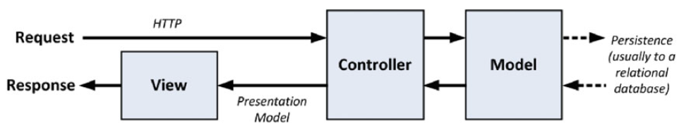

# Notes on ASP.NET Core

[TOC]

I have written these notes while working on a couple of great books on the subject. See [Sources used](#sources-used).

`Models` - the `M` in `MVC` - contain the data that users work with. There are two broad types of model:

* `view models`, which represent just data passed from the controller to the view, and
* `domain models`, which contain the data in a business domain, along with the operations, transformations, and rules for creating, storing, and manipulating that data, collectively referred to as the model logic.

In ASP.NET Core MVC, `controllers` are C# classes, usually derived from the `Microsoft.AspNetCore.Mvc.Controller` class. Each **public** method in a class derived from `Controller` is an `action method`, which is associated with a `URL`.



### Conventions

* put the third-party JavaScript and CSS packages you rely on in the `wwwroot/lib` folder.
* **convention over configuration**
* the controller for `/product` uri should have the name `ProductController.cs` and reside in the `/Controllers` folder; from other parts in the project, such as when using an HTML helper method, you specify the first part of the name (`Product`), and MVC automatically appends `Controller` to the name and starts looking for the controller class.
* views for `/product` uri associated with `ProductController` should all reside in the `/Views/Product` folder.
* MVC expects that the `default view` for an `action method` should be named after that method. For example, the default view associated with an action method called `List` should be called `List.cshtml`. Thus, for the `List action method` in the `ProductController` class, the `default view` is expected to be `/Views/Product/List.cshtml`. The `default view` is used when you return the result of calling the `View` method in an action method, like this:

```csharp
  return View();
```

  You can specify a different view by name, like this:

```csharp
  return View("MyOtherView");
```

* When looking for a `view`, MVC looks in the folder named after the controller and then in the `/Views/Shared` folder. This means that I can put views that will be used by more than one controller in the `/Views/Shared` folder and MVC will find them.
* The naming convention for `layouts` is to prefix the file with an underscore (`_`) character, and layout files are placed in the `/Views/Shared` folder. This layout is applied to all views by default through the `/Views/_ViewStart.cshtml` file. If you do not want the default layout applied to views, you can change the settings in `ViewStart.cshtml` (or delete the file entirely) to specify another layout in the view, like this:

```csharp
  @{
    Layout = "~/_MyLayout.cshtml";
  }
```

* Or you can disable any layout for a given view, like this:

```csharp
  @{
    Layout = null;
  }
```

### Extension methods

#### Class extensions

Suppose we have a simple class:

```csharp
using System.Collections.Generic;

namespace LanguageFeatures.Models
{
    public class ShoppingCart
    {
        public IEnumerable<Product> Products { get; set; }
    }
}
```

We want to extend its functionality with a new method to calculate the total amount:

```csharp
public static decimal TotalPrices(this ShoppingCart cartParam)
{
    decimal total = 0;

    foreach (Product prod in cartParam.Products)
    {
        total += prod?.Price ?? 0;
    }
    return total;
}
```

We can then use this extension method like this:

```csharp
ShoppingCart cart = new ShoppingCart { Products = Product.GetProducts() };
decimal cartTotal = cart.TotalPrices();
```

#### Interface extensions

```csharp
using System.Collections;
using System.Collections.Generic;

namespace LanguageFeatures.Models
{
    public class ShoppingCart : IEnumerable<Product>
    {
        public IEnumerable<Product> Products { get; set; }

        public IEnumerator<Product> GetEnumerator()
        {
           return Products.GetEnumerator();
        }

        IEnumerator IEnumerable.GetEnumerator()
        {
            return GetEnumerator();
        }
    }
}
```

We can rewrite our extension method like this:

```csharp
public static decimal TotalPrices(this IEnumerable<Product> products)
{
    decimal total = 0;

    foreach (Product prod in products)
    {
        total += prod?.Price ?? 0;
    }
    return total;
}
```

and use it with any object of type `IEnumerable<Product>` like `ShoppingCart` and `Product` array:

```csharp
ShoppingCart cart = new ShoppingCart { Products = Product.GetProducts() };

Product[] productArray =
{
    new Product {Name = "Kayak", Price = 275M},
    new Product {Name = "Lifejacket", Price = 48.95M}
};

decimal cartTotal = cart.TotalPrices();
decimal arrayTotal = productArray.TotalPrices();
```

#### Filtering

Extension methods can be used to `filter` collections of objects. An extension method that operates on an `IEnumerable<T>` and that also returns an `IEnumerable<T>` can use the `yield` keyword to apply selection criteria to items in the source data to produce a reduced set of results.

```csharp
using System.Collections.Generic;

namespace LanguageFeatures.Models
{
    public static class MyExtensionMethods
    {
        public static IEnumerable<Product> FilterByPrice(
            this IEnumerable<Product> productEnum,
            decimal minimumPrice)
        {
            foreach (Product prod in productEnum)
            {
                if ((prod?.Price ?? 0) >= minimumPrice)
                {
                    yield return prod;
                }
            }
        }
    }
}
```

### Lambda anonymous functions

We can repeat this process indefinitely and create a different filter method for every property and every combination of properties that we are interested in. A more elegant approach is to separate out the code that processes the enumeration from the selection criteria. C# makes this easy by allowing functions to be passed around as objects. We can then create a single extension method that filters an enumeration of Product objects but that delegates the decision about which ones are included in the results to a separate function.

```csharp
public static IEnumerable<Product> Filter(
    this IEnumerable<Product> productEnum,
    Func<Product, bool> selector)
{
    foreach (Product prod in productEnum)
    {
        if (selector(prod))
        {
            yield return prod;
        }
    }
}
```

Now, we can use this `Filter` function as follows:

```csharp
decimal priceFilterTotal = productArray
    .Filter(p => (p?.Price ?? 0) >= 20)
    .TotalPrices();
decimal nameFilterTotal = productArray
    .Filter(p => p?.Name?[0] == 'S')
    .TotalPrices();
```

`Lambdas` can also be used in class properties, e.g.:

```csharp
public bool NameBeginsWithS => Name?[0] == 'S';
```

### Asynchronous methods

Add `"System.Net.Http": "4.1.0"` dependency in `project.json`.

Here is how we could make an asynchronous call "the hard way":

```csharp
public static Task<long?> GetPageLengthWithoutAsyncAwait()
{
    HttpClient client = new HttpClient();
    var httpTask = client.GetAsync("http://apress.com");
    // we could do other things here while the HTTP request is performed
    return httpTask.ContinueWith((Task<HttpResponseMessage> antecedent) =>
    {
        return antecedent.Result.Content.Headers.ContentLength;
    });
}
```

And here is the clever way:

```csharp
public static async Task<long?> GetPageLength()
{
    HttpClient client = new HttpClient();
    var httpMessage = await client.GetAsync("http://apress.com");
    // we could do other things here while the HTTP request is performed
    return httpMessage.Content.Headers.ContentLength;
}
```

And we could use this in our controller:

```csharp
using LanguageFeatures.Models;
using Microsoft.AspNetCore.Mvc;
using System.Threading.Tasks;

namespace LanguageFeatures.Controllers
{
    public class HomeController : Controller
    {
        public async Task<ViewResult> Index()
        {
            long? length = await MyAsyncMethods.GetPageLength();
            return View(new string[] { $"Length: {length}" });
        }
    }
}
```

### Getting property names with nameof

If we use lambdas the classic way:

```csharp
products.Select(p => $"Name: {p.Name}, Price: {p.Price}")
```

we of course get no intellisense on `Name:` and `Price:`. So, if we change the property name in the class and forget to change these strings here, we get a mismatch.

Fortunately, we can now rewrite the same code like this:

```csharp
products.Select(p => $"{nameof(p.Name)}: {p.Name}, {nameof(p.Price)}: {p.Price}")
```

but then we will get intellisense and type safety.

### Workflow with an empty project

* create a new empty ASP.NET Core project
* add `"Microsoft.AspNetCore.Mvc": "1.0.1"` dependency in `project.json`
* add `"System.Net.Http": "4.1.0"` dependency in `project.json`
* add `Mvc` to `Startup.cs`:

```csharp
using Microsoft.AspNetCore.Builder;
using Microsoft.AspNetCore.Hosting;
using Microsoft.Extensions.DependencyInjection;
using Microsoft.Extensions.Logging;

namespace LanguageFeatures
{
    public class Startup
    {
        public void ConfigureServices(IServiceCollection services)
        {
            services.AddMvc();
        }

        public void Configure(IApplicationBuilder app, IHostingEnvironment env, ILoggerFactory loggerFactory)
        {
            app.UseMvcWithDefaultRoute();
        }
    }
}
```

### Razor

#### View Imports File

Use `_ViewImports.cshtml` file in the `Views` folder to specify the standard include namespaces. Then you can omit them in the individual views.

#### View Start File

Normally, we have to specify the layout file we want in every view. Therefore, if we need to rename the layout file, we are going to have to find every view that refers to it and make a change, which will be an error-prone process and counter to the general theme of easy maintenance that runs through MVC development.

We can resolve this by using a `view start file`. When it renders a view, MVC will look for a file called `_ViewStart.cshtml` and we can put it in the `Views` folder. The contents of this file will be treated as though they were contained in the view file itself, and we can use this feature to automatically set a value for the Layout property.

```csharp
@{
    Layout = "_BasicLayout";
}
```

Now, in the views that should use this `_BasicLayout`, we can omit the layout line.

We do not have to specify that we want to use the view start file. MVC will locate the file and use its contents automatically. The values defined in the view file take precedence, which makes it easy to override the view start file.

We can also use `multiple view start files` to set defaults for different parts of the application. Razor looks for the closest view start file to the view that it being processed, which means that you can override the default setting by adding a view start file to the `Views/Home` or `Views/Shared` folders, for example.

!!! warning "Caution"
    It is important to understand the difference between `omitting the Layout property` from the view file and `setting it to null`. If your view is self-contained and you do not want to use a layout, then set the Layout property to null. If you omit the Layout property, then MVC will assume that you do want a layout and that it should use the value it finds in the view start file.

#### ViewBag property

The `ViewBag` property returns a `dynamic object` that can be used to define arbitrary properties. Since the `ViewBag` is dynamic, we don’t have to declare the property names in advance, but it does mean that Visual Studio is unable to provide autocomplete suggestions for view bag properties.

#### Attribute values

We can also use Razor expressions to set the value of `element attributes`, not only on the content.

```none
<div data-productid="@Model.ProductID" data-stocklevel="@ViewBag.StockLevel">
    <p>Product Name: @Model.Name</p>
    <p>Product Price: @($"{Model.Price:C2}")</p>
    <p>Stock Level: @ViewBag.StockLevel</p>
</div>
```

#### Switch statement

We have to cast the dynamic ViewBag properties to the right type once, inside the condition:

```none
@switch ((int)ViewBag.StockLevel) {...}
```

After that, inside the body, we dont need to do it any more:

```none
default:
    @: @ViewBag.StockLevel in Stock
    break;
```

We do not have to put the elements or expressions in quotes or denote them in any special way—the Razor engine will interpret these as output to be processed. However, if we want to insert literal text into the view when it is not contained in an HTML element, then we need to give Razor a helping hand and prefix the line with an `@` character (see above).

### Visual Studio tips and tricks

#### Enable Developer Exception Page

In `Startup.cs` add this line to the `Configure` method:

```csharp
app.UseDeveloperExceptionPage();
```

### Browser Link Loader

Add

```csharp
"Microsoft.VisualStudio.Web.BrowserLink.Loader": "14.0.0"
```

to `project.json` dependencies list. Also add

```csharp
app.UseBrowserLink();
```

to the `Configure` method of `Startup.cs`.

Run the project without debugging (Ctrl + F5) and you see this kind of code added to the HTML:

```html
<!-- Visual Studio Browser Link -->
<script type="application/json" id="__browserLink_initializationData">
    {"requestId":"497a61f26544432a857e06ab5d501b7f","requestMappingFromServer":false}
</script>
<script type="text/javascript"
        src="http://localhost:2701/029471b4ee954e43adc0d452954d080f/browserLink"
        async="async">
</script>
<!-- End Browser Link -->
```

!!! warning "Alas"
    I still see no added value to it. :( Unless it is just the synchronized browsing using multiple browsers. I also see this error in the browser console:

    `[14:07:17 GMT+0200 (West-Europa (zomertijd))] Browser Link: Failed to invoke return value`
    `callback: TypeError: Cannot read property 'files' of null`

### Static files

ASP.NET Core includes support for delivering `static files` from the wwwroot folder to clients but it isn’t enabled by default when the Empty template is used to create the project. To enable static file support, add

```csharp
"Microsoft.AspNetCore.StaticFiles": "1.0.0"
```

to `project.json` dependencies list. Also add

```csharp
app.UseStaticFiles();
```

to the `Configure` method of `Startup.cs`.

### Bundling and minifying

Install `Bundler and Minifier` extension for the Visual Studio. After that it is possible to add `css` or `js` files to the bundle by selecting them one by one and choosing `Bundler & Minifier | Bundle and Minify Files (Shift + Alt + F)` from the right mouse button menu.

This will create a `bundle.css` or `bundle.js` file and also `bundleconfig.json` in the project root folder. Make sure the order of the files is what you need as `loading order`.

### Unit Testing with `xUnit` Framework

#### Preparation

* create `test` folder inside the solution folder next to `src` folder
* add new `.NET Core | Class Library (.NET Core)` project inside the `test` folder
* add this code to its `project.json` file (check the latest versions):

```json
  {
      "version": "1.0.0-*",
      "testRunner": "xunit",

      "dependencies": {
          "Microsoft.NETCore.App": {
              "type": "platform",
              "version": "1.0.1"
          },
          "xunit": "2.1.0",
          "dotnet-test-xunit": "2.2.0-preview2-build1029"
      },

      "frameworks": {
          "netcoreapp1.0": {
              "imports": ["dotnet5.6", "portable-net45+win8"]
          }
      }
  }
```

* this configuration tells Visual Studio that three packages are required:
    * the `Microsoft.NETCore.App` package provides the `.NET Core API`.
    * the `xunit` package provides the testing framework.
    * the `dotnet-test-xunit` package provides the integration between `xUnit` and `Visual Studio`.
* add the main project reference to the dependencies, e.g.

```json
  {
      "dependencies": {
          ...
          "WorkingWithVisualStudio": "1.0.0"
          ...
      }
  }
```

#### Fact and Theory

* In the `xUnit` framework, a `Fact` is one single unit test. Example:

```csharp
  [Fact]
  public void IndexActionModelIsComplete() {
      // Arrange
      var controller = new HomeController();
      controller.Repository = new ModelCompleteFakeRepository();

      // Act
      var model = (controller.Index() as ViewResult)?.ViewData.Model
      as IEnumerable<Product>;

      // Assert
      Assert.Equal(controller.Repository.Products, model,
          Comparer.Get<Product>((p1, p2) => p1.Name == p2.Name
              && p1.Price == p2.Price));
  }
```

* A `Theory` is a way to parametrize the unit test in such a way that it becomes possible to run the same test multiple times, each time with a different set of parameter values. Example:

```csharp
  [Theory]
  [InlineData(275, 48.95, 19.50, 24.95)]
  [InlineData(5, 48.95, 19.50, 24.95)]
  public void IndexActionModelIsComplete(decimal price1, decimal price2,
  decimal price3, decimal price4) {
      // Arrange
      var controller = new HomeController();
      controller.Repository = new ModelCompleteFakeRepository {
          Products = new Product[] {
              new Product {Name = "P1", Price = price1 },
              new Product {Name = "P2", Price = price2 },
              new Product {Name = "P3", Price = price3 },
              new Product {Name = "P4", Price = price4 },
          }
      };

      // Act
      var model = (controller.Index() as ViewResult)?.ViewData.Model
                      as IEnumerable<Product>;

      // Assert
      Assert.Equal(controller.Repository.Products, model,
          Comparer.Get<Product>((p1, p2) => p1.Name == p2.Name
              && p1.Price == p2.Price));
  }
```

#### Getting Test Data from a Method or Property

We can create methods or properties giving us the enumerations for the test parameter values in a separate class, e.g. `ProductTestData.cs`. Then we can use `MemberData` attribute to specify it for the unit test to use. Example:

```csharp
[Theory]
[ClassData(typeof(ProductTestData))]
public void IndexActionModelIsComplete(Product[] products ) {...}
```

If we want to include the test data in the same class as the unit tests, then you can use the `MemberData` attribute instead of `ClassData`. The `MemberData` attribute is configured using a string that specifies the name of a static method that will provide an `IEnumerable<object[]>`, where each object array in the sequence is a set of arguments for the test method. Example:

```csharp
[Theory]
[MemberData("GetData")]
public void IndexActionModelIsComplete(Product[] products ) {...}
```

and the `GetData` should look something like this

```csharp
public static IEnumerable<object[]> GetData
{
    get
    {
    	// ...
        yield return new object[] { 8, 21 };
        yield return new object[] { 16, 987 };
    }
}
```

Every `yield` statement should return an array of objects to substitute for the Product properties. And the method itself should be of type `IEnumerable<object[]>`.

### Mocking with MOQ

`Microsoft` created a special fork of the `Moq` project and ported it to work with `.NET Core`.

In order to be able to install the `Moq NuGet package`, we need first to configure the `NuGet Options`. Open `Tools | Options | NuGet Package Manager`, click on `Package Sources` and then on the green plus sign. Configure the new package source as follows:

* `Name: ASP.NET Contrib`
* `Source: https://www.myget.org/F/aspnet-contrib/api/v3/index.json`

Add these two packages to the `package.json` in the test project:

```json
"moq.netcore": "4.4.0-beta8"
"System.Diagnostics.TraceSource": "4.0.0"
```

Usage example:

```csharp
[Fact]
public void RepositoryPropertyCalledOnce()
{
    // Arrange
    var mock = new Mock<IRepository>();
    mock.SetupGet(m => m.Products)
        .Returns(new[] { new Product { Name = "P1", Price = 100 } });
    var controller = new HomeController { Repository = mock.Object };

    // Act
    var result = controller.Index();

    // Assert
    mock.VerifyGet(m => m.Products, Times.Once);
}
```

Explanation:

* `var mock = new Mock<IRepository>();` - define the interface to be mocked
* `SetupGet(m => m.Products)` - specify the property to be tested
* `.Returns(...)` - specify the test value to be returned
* `Repository = mock.Object` - `Object` is the special property that gives back the object we mock for this test
* `mock.VerifyGet(m => m.Products, Times.Once);` - one of the verify methods to inspect the getter property

### SportsStore

* Create a new empty `ASP.NET Core Web Application (.NET Core)` project/solution.
* Add these packages/tools to the `project.json` file:

```json
  "dependencies": {
      ...
      "Microsoft.AspNetCore.Razor.Tools": {
          "version": "1.0.0-preview2-final",
          "type": "build"
      },
      "Microsoft.AspNetCore.StaticFiles": "1.0.0",
      "Microsoft.AspNetCore.Mvc": "1.0.1"
  },
  "tools": {
      "Microsoft.AspNetCore.Razor.Tools": "1.0.0-preview2-final",
      ...
  },
```
* In addition to the packages in the `dependencies` section, there is an addition to the `tools` section of the `project.json` file that configures the `Microsoft.AspNetCore.Razor.Tools` package for use in Visual Studio and enables IntelliSense for the built-in tag helpers, which are used to create HTML content that is tailored to the configuration of the MVC application.
* Here is the `Startup.cs`:

```csharp
  using Microsoft.AspNetCore.Builder;
  using Microsoft.AspNetCore.Hosting;
  using Microsoft.AspNetCore.Http;
  using Microsoft.Extensions.DependencyInjection;
  using Microsoft.Extensions.Logging;

  namespace SportsStore
  {
      public class Startup
      {
          public void ConfigureServices(IServiceCollection services)
          {
              services.AddMvc();
          }

          public void Configure(IApplicationBuilder app,
          IHostingEnvironment env, ILoggerFactory loggerFactory)
          {
              app.UseDeveloperExceptionPage();
              app.UseStatusCodePages();
              app.UseStaticFiles();
              app.UseMvcWithDefaultRoute();
          }
      }
  }
```
* The `ConfigureServices` method is used to set up shared objects that can be used throughout the application through the `dependency injection` feature. The `AddMvc` method that is called in the `ConfigureServices` method is an extension method that sets up the shared objects used in MVC applications.
* The `Configure` method is used to set up the features that receive and process `HTTP requests`.
* add these folders: `Models`, `Controllers`, `Views`
* in the `Views` folder add `_ViewImports.cshtml` file:

```csharp
  @using SportsStore.Models
  @addTagHelper *, Microsoft.AspNetCore.Mvc.TagHelpers
```
* create the unit test project `SportsStore.Tests` in the `test` folder.
* Configure its `project .json` as follows:

```json
  {
      "version": "1.0.0-*",
      "testRunner": "xunit",
      "dependencies": {
          "Microsoft.NETCore.App": {
              "type": "platform",
              "version": "1.0.1"
          },
          "xunit": "2.1.0",
          "dotnet-test-xunit": "2.2.0-preview2-build1029",
          "moq.netcore": "4.4.0-beta8",
          "System.Diagnostics.TraceSource": "4.0.0",
          "SportsStore": "1.0.0"
      },
      "frameworks": {
          "netcoreapp1.0": {
              "imports": [ "dotnet5.6", "portable-net45+win8" ]
          }
      }
  }
```
* Make sure that both `project.json` files refer to the same `ASP.NET Core MVC` version.
* Add your model class `Product.cs`, repository interface `IProductRepository` and a simple fake repository `FakeProductRepository`
* Register the fake repository as a service in `Startup.cs`:

```csharp
  public void ConfigureServices(IServiceCollection services)
  {
      services.AddTransient<IProductRepository, FakeProductRepository>();
      ...
  }
```
* Add the following standard views:
  * `Views/Shared/_Layout.cshtml`
  * `Views/_ViewStart.cshtml` refering to `_Layout.cshtml` by default
* Example of setting up the default route in `Startup.cs`. Substitute

```csharp
  app.UseMvcWithDefaultRoute();
```
* with

```csharp
  app.UseMvc(routes =>
  {
      routes.MapRoute(
          name: "default",
          template: "{controller=Product}/{action=List}/{id?}");
  });
```

### Scaffolding

Some people prefer to have certain features automatically created when they create new controller or views. That is called `scaffolding`. If you want that, add the following packages to the `project.json` file:

```json
...
"dependencies": {
    ...
    "Microsoft.AspNetCore.StaticFiles": "1.0.0",
    "Microsoft.AspNetCore.Mvc": "1.0.0",
    "Microsoft.VisualStudio.Web.CodeGeneration.Tools": {
        "version": "1.0.0-preview2-final",
        "type": "build"
    },
    "Microsoft.VisualStudio.Web.CodeGenerators.Mvc": {
        "version": "1.0.0-preview2-final",
        "type": "build"
    }
}
...
"tools": {
    ...
    "Microsoft.VisualStudio.Web.CodeGeneration.Tools": {
        "version": "1.0.0-preview2-final",
        "imports": [
            "portable-net45+win8+dnxcore50",
            "portable-net45+win8"
        ]
    }
}
...
```

### Setup the database

* add `EntityFramework` packages to `package.json`:

```json
  "dependencies": {
      ...
      "Microsoft.EntityFrameworkCore.SqlServer": "1.0.1",
      "Microsoft.EntityFrameworkCore.Tools": "1.0.0-preview2-final"
  }
```
* and the tools:

```json
  "tools": {
      ...
      "Microsoft.EntityFrameworkCore.Tools": {
          "version": "1.0.0-preview2-final",
          "imports": [ "portable-net45+win8+dnxcore50", "portable-net45+win8" ]
      }
  }
```

* The `database context class` is the bridge between the `application` and the `EF Core` and provides access to the application’s data using model objects. To create the database context class for the `SportsStore` application, we add a class file called `ApplicationDbContext.cs` to the `Models` folder:

```csharp
  using Microsoft.EntityFrameworkCore;

  namespace SportsStore.Models
  {
      public class ApplicationDbContext : DbContext
      {
          public ApplicationDbContext(DbContextOptions<ApplicationDbContext> options)
              : base(options) { }
          public DbSet<Product> Products { get; set; }
      }
  }
```
* To populate the database initially with some data, we use `SeedData.cs` class:

```csharp
  using System.Linq;
  using Microsoft.AspNetCore.Builder;
  using Microsoft.Extensions.DependencyInjection;
  namespace SportsStore.Models
  {
      public static class SeedData
      {
          public static void EnsurePopulated(IApplicationBuilder app)
          {
              ApplicationDbContext context =
                  app.ApplicationServices.GetRequiredService<ApplicationDbContext>();

              if (!context.Products.Any())
              {
                  context.Products.AddRange(
                  new Product
                  {
                      Name = "Kayak",
                      Description = "A boat for one person",
                      Category = "Watersports",
                      Price = 275
                  },
                  ...

                  context.SaveChanges();
              }
          }
      }
  }
```
* The static `EnsurePopulated` method receives an `IApplicationBuilder` argument, which is the class used in the `Configure` method of the `Startup` class to register middleware classes to handle HTTP requests, which is where we ensure that the database has content.
* The `EnsurePopulated` method obtains an `ApplicationDbContext` object through the `IApplicationBuilder` interface and uses it to check whether there are any `Product` objects in the database. If there are no objects, then the database is populated using a collection of `Product` objects using the `AddRange` method and then written to the database using the `SaveChanges` method.
* The next step is to create a class that implements the `IProductRepository` interface and gets its data using `Entity Framework Core` from the `ApplicationDbContext`.

```csharp
  using System.Collections.Generic;

  namespace SportsStore.Models
  {
      public class EFProductRepository : IProductRepository
      {
          private ApplicationDbContext context;
          public EFProductRepository(ApplicationDbContext ctx)
          {
              context = ctx;
          }
          public IEnumerable<Product> Products => context.Products;
      }
  }
```
* create `appsettings.json` file in the project root folder based on the `ASP.NET Configuration File` template and configure the connection string:

```json
  {
      "Data": {
          "SportStoreProducts": {
              "ConnectionString": "Server=(localdb)\\MSSQLLocalDB;Database=SportsStore;Trusted_Connection=True;MultipleActiveResultSets=true"
          }
      }
  }
```
* add a new dependency to read the `json` configuration file:

```json
  "dependencies": {
      ...
      "Microsoft.Extensions.Configuration.Json": "1.0.0"
  },
```
* configure the `Startup.cs`:

```csharp
  ...
  using Microsoft.EntityFrameworkCore;
  using Microsoft.Extensions.Configuration;

  namespace SportsStore
  {
      public class Startup
      {
          IConfigurationRoot Configuration;

          public Startup(IHostingEnvironment env)
          {
              Configuration = new ConfigurationBuilder()
                  .SetBasePath(env.ContentRootPath)
                  .AddJsonFile("appsettings.json").Build();
          }

          public void ConfigureServices(IServiceCollection services)
          {
              services.AddDbContext<ApplicationDbContext>(options =>
                  options.UseSqlServer(Configuration["Data:SportStoreProducts:ConnectionString"]));
              services.AddTransient<IProductRepository, EFProductRepository>();
              ...
          }

          public void Configure(
              IApplicationBuilder app,
              IHostingEnvironment env,
              ILoggerFactory loggerFactory)
          {
              ...
              SeedData.EnsurePopulated(app);
          }
      }
  }
```
* open `Tools | Nuget Package Manager | Package Manager Console` to create and apply database migrations:

```bash
  Add-Migration Initial
  Update-Database
```
* rebuild the solution and run - we will see the list of products loaded from the database.

### ViewModels and TagHelpers

* If we want to customize the information to be used in the view, we can do that with `ViewModels`. For that we create a `ViewModels` subfolder inside the `Models` folder. They can `be registered` in `_ViewImports.cshtml`.
* `TagHelpers` are one of the most useful ways that you can introduce C# logic into your views. The code for a tag helper can look tortured because C# and HTML don’t mix easily. But using tag helpers is preferable to including blocks of C# code in a view because a tag helper can be easily `unit tested`. Most MVC components, such as controllers and views, are discovered automatically, but tag helpers `have to be registered` in `_ViewImports.cshtml`.
* To test the `tag helper` class, I call the `Process` method with test data and provide a `TagHelperOutput` object that is inspected to see the HTML that was generated.
* When we pass the data to the view via a view model, we need to replace the type. E.g. it can become `@model ProductsListViewModel` and `Model.Products` instead of `@model IEnumerable<Product>` and `Model`.

### Installing Bootstrap package

Add `bower.json` file to the project root:

```json
{
    "name": "asp.net",
    "private": true,
    "dependencies": {
        "bootstrap": "3.3.7"
    }
}
```

This will add `wwwroot/lib` folder and inside it `bootstrap` and `jquery` sources.

### Improving the URLs

Normally, the page links look like this:

`http://localhost/?page=2`

But we can make them more user friendly by creating a scheme that follows the pattern of `composable URLs`, which look like this:

`http://localhost/Page2`

To do that we register a new route in our MVC middleware (`Configure` method in `Startup.cs`):

```csharp
routes.MapRoute(
    name: "pagination",
    template: "Products/Page{page}",
    defaults: new { Controller = "Product", action = "List" });
```

It is important that this route is added `before` the default route.

### Enabling Sessions

Add these new packages to the `package.json`:

```json
"Microsoft.AspNetCore.Session": "1.0.0",
"Microsoft.Extensions.Caching.Memory": "1.0.0",
"Microsoft.AspNetCore.Http.Extensions": "1.0.0"
```

Register new services and middleware to the `Startup.cs`:

```csharp
public void ConfigureServices(IServiceCollection services) {
    ...
    services.AddMemoryCache();
    services.AddSession();
    services.AddMvc();
}

public void Configure(IApplicationBuilder app,
    ...
    app.UseSession();
    app.UseMvc(...);
}
```

!!! important "AddMemoryCache"
    The `AddMemoryCache` method call sets up the in-memory data store. The `AddSession` method registers the services used to access session data, and the `UseSession` method allows the session system to automatically associate requests with sessions when they arrive from the client.

### Annotations

* `BindNever` attribute prevents the user supplying values for these properties in an HTTP request.

** Adding migrations

Suppose we add a new `DbSet` to our `ApplicationDbContext.cs`:

```csharp
public class ApplicationDbContext : DbContext
{
    public ApplicationDbContext(DbContextOptions<ApplicationDbContext> options)
        : base(options) { }
    ...
    public DbSet<Order> Orders { get; set; }
}
```

To create the `migration`, open the NuGet `Package Manger Console` from the `Tools ➤ NuGet Package Manage` menu and run the following command :

`Add-Migration Orders`

This command tells EF Core to take a new snapshot of the application, work out how it differs from the previous database version, and generate a new migration called `Orders`. The name `Orders` here is arbitrary but it is handy to let it reflect the change.

To update the database schema, run the following command:

`Update-Database`

### Resetting the Database

When you are making frequent changes to the model, there will come a point when your migrations and your database schema get out of sync. The easiest thing to do is delete the database and start over. However, this applies **only during development**, of course, because you will lose any data you have stored.

* Select the `SQL Server Object Explorer` item from the Visual Studio `View` menu and click the `Add Sql Server` button.
* Enter `(localdb)\mssqllocaldb` into the `Server Name` field and click the `Connect` button. A new item will appear in the `SQL Server Object Explorer` window, which you can expand to see the `LocalDB` databases that have been created.
* Right-click the database you want to remove and select `Delete` from the pop-up menu. `Check the option to close the existing connections` and then click the `OK` button to delete the database.
* Once the database has been removed, run the following command from the `Package Manager Console` to create the database and apply the migrations you have created by running the following command:

`Update-Database`

* This will reset the database so that it accurately reflects your model and allow you to return to developing your application.

### Using TempData

We are using TempData in the POST method in a controller:

```csharp
[HttpPost]
public IActionResult Edit(Product product)
{
    if (ModelState.IsValid)
    {
        _repository.SaveProduct(product);
        TempData["message"] = $"{product.Name} has been saved";
        return RedirectToAction("Index");
    }
    else
    {
        // there is something wrong with the data values
        return View(product);
    }
}
```

We check that the model binding process has been able to validate the data submitted to the user by reading the value of the `ModelState.IsValid` property. If everything is OK, we save the changes to the repository and redirect the user to the `Index` action so they see the modified list of products. If there is a problem with the data, we render the default view again so that the user can make corrections.

After we have saved the changes in the repository, we store a message using the `TempData` feature, which is part of the `ASP.NET Core session state` feature. This is a `key/value` dictionary similar to the `session data` and `view bag` features we used previously.

The key difference from `session data` is that `temp data` persists until it is read. We cannot use `ViewBag` in this situation because `ViewBag` passes data between the `controller` and `view`, and it cannot hold data for longer than `the current HTTP request`. When an edit succeeds, the browser is redirected to a new URL, so the `ViewBag` data is lost.

We could use the `session data` feature, but then the message would be persistent until we explicitly removed it, which we would rather not have to do.

So, the `temp data` feature is the perfect fit. The data is restricted to a `single user’s session` (so that users do not see each other’s `TempData`) and will persist long enough for us to read it. We will read the data in the `view` rendered by the `action method` to which we redirect the user

The message will be displayed once and disappear if you reload the screen with the template using this `temp data`, because `TempData` is deleted when it is read. That is convenient since we do not want old messages hanging around.

### Localization hell

By the time we get to editing with validation, something bad happens. It looks that by default the `jQuery-validation` (client side validation) expects `"en-US"` as its culture and the server side validation expects `"nl-NL"`. Therefore, when I see `€` as currency and `","` as decimal separator, I cannot change the price. Neither `","` nor `"."` are accepted. One is rejected by the client side and the other by the server side validation.

Temporary workaround was to configure `"en-US"` as the default culture, so that `"$"` and `"."` are displayed on the screen. Then the validation works.

### Adding Identity

Add a new dependency to `project.json`:

```json
"dependencies": {
    ...
    "Microsoft.AspNetCore.Identity.EntityFrameworkCore": "1.0.0"
}
```

Add a new `AppIdentityDbContext` class to `Models` folder:

```csharp
using Microsoft.AspNetCore.Identity.EntityFrameworkCore;
using Microsoft.EntityFrameworkCore;

namespace SportsStore.Models
{
    public class AppIdentityDbContext : IdentityDbContext<IdentityUser>
    {
        public AppIdentityDbContext(DbContextOptions<AppIdentityDbContext> options)
            : base(options) { }
    }
}
```

and a new connection string in `appsettings.json` file:

```json
{
    "Data": {
        ...
        "SportStoreIdentity": {
            "ConnectionString": "Server=(localdb)\\MSSQLLocalDB;Database=Identity;Trusted_Connection=True;MultipleActiveResultSets=true"
        }
    }
}
```

Add new services to `ConfigureServices` in `Startup.cs`:

```csharp
public void ConfigureServices(IServiceCollection services)
{
    ...
    services.AddDbContext<AppIdentityDbContext>(options =>
        options.UseSqlServer(Configuration["Data:SportStoreIdentity:ConnectionString"]));

    services.AddIdentity<IdentityUser, IdentityRole>()
        .AddEntityFrameworkStores<AppIdentityDbContext>();
    ...
}
```

and new entries in `Configure`:

```csharp
public void Configure()
    app.UseIdentity();
    app.UseMvc();
    SeedData.EnsurePopulated(app);
    IdentitySeedData.EnsurePopulated(app);
}
```

`IdentitySeedData` should be created in the `Models` folder to create an administrative account.

```csharp
using Microsoft.AspNetCore.Builder;
using Microsoft.AspNetCore.Identity;
using Microsoft.AspNetCore.Identity.EntityFrameworkCore;
using Microsoft.Extensions.DependencyInjection;

namespace SportsStore.Models
{
    public static class IdentitySeedData
    {
        private const string adminUser = "Admin";
        private const string adminPassword = "Secret123$";

        public static async void EnsurePopulated(IApplicationBuilder app)
        {
            UserManager<IdentityUser> userManager = app.ApplicationServices
                .GetRequiredService<UserManager<IdentityUser>>();

            IdentityUser user = await userManager.FindByIdAsync(adminUser);

            if (user == null)
            {
                user = new IdentityUser("Admin");
                await userManager.CreateAsync(user, adminPassword);
            }
        }
    }
}
```

### Adding Identity migrations

* `Add-Migration Initial -Context AppIdentityDbContext`
* `Update-Database -Context AppIdentityDbContext`

This will create the new database and add the `AspNetUsers` and `AspNetRoles` in it.

### Adding Authorization

When `ASP.NET Core Identity` is in place, we can apply `Authorization`. We don’t want to stop unauthenticated users from accessing the other action methods in the `Order` controller, so we have applied the `Authorize` attribute only to the `List` and `MarkShipped` methods.

```csharp
[Authorize]
public ViewResult List() =>
    View(_repository.Orders.Where(o => !o.Shipped));

[HttpPost]
[Authorize]
public IActionResult MarkShipped(int orderID) {...}
```

We want to protect **all of the action methods** defined by the `Admin` controller, and we can do this by applying the `Authorize`attribute to the controller class, which then applies the authorization policy to all the action methods it contains.

```csharp
[Authorize]
public class AdminController : Controller
{...}
```

!!! warning "Caution"
    In general, using client-side data validation is a good idea. It offloads some of the work from your server and gives users immediate feedback about the data they are providing. However, you should not be tempted to perform authentication at the client, as this would typically involve sending valid credentials to the client so they can be used to check the username and password that the user has entered, or at least trusting the client’s report of whether they have successfully authenticated. Authentication should always be done at the server.

### Sources used

1. [Adam Freeman - Pro ASP.NET Core MVC (2016)][1]
2. [Christian Nagel - Professional C# 6 and .NET Core 1.0 (2016)][2]

[1]: http://www.apress.com/9781484203989?gtmf=s
[2]: http://www.wrox.com/WileyCDA/WroxTitle/Professional-C-6-and-NET-Core-1-0.productCd-111909660X.html
