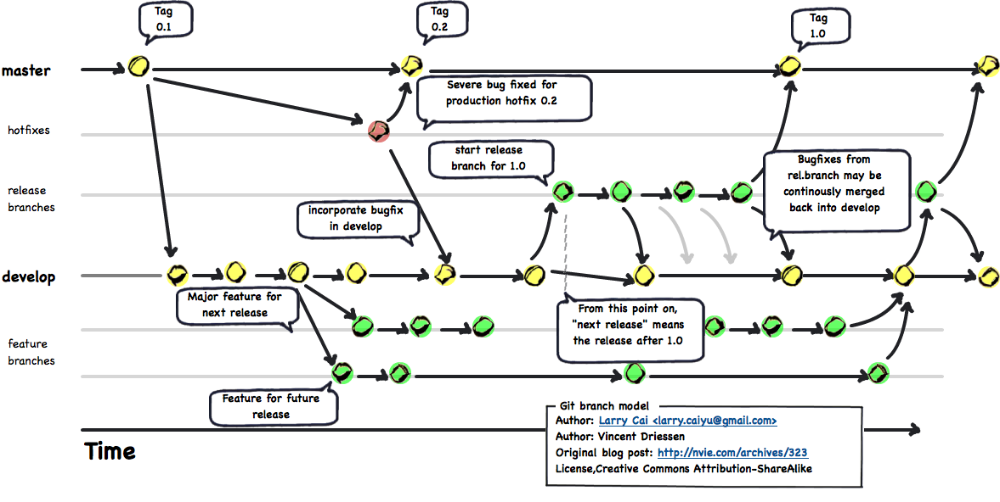

[TOC]

## Introduction

__GitFlow__ is a Git Workflow Extension. The following diagram gives a good idea how it works.



---

## Installation

### Prerequisites

Make sure you have __Git__ installed. Note the path to the `Git` directory. In this manual, we will use `C:\Program Files\Git`.

### Prepare the GitFlow local repository

!!! warning "External dependencies"

    1. Submodule dependency on __shFlags__
    2. 3 files from the __util-linux-package__

Go to the [util-linux-ng for Windows](http://gnuwin32.sourceforge.net/packages/util-linux-ng.htm) website. Download the __Binaries__ and __Dependencies__ in zip-format. Retrieve `getopt.exe` file from the `bin` folder in the __Binaries__. Retrieve `libintl3.dll`, and `libiconv2.dll` from the `bin` folder in the __Dependencies__ packages. (This [link](http://www.syncfusion.com/downloads/support/directtrac/general/ze/dependencies142480694.zip) has them all in one place.)

Copy all three files to the `bin` folder of your __Git__ installation, e.g. `C:\Program Files\Git\bin`.

Open an Administrator command window and run these commands (make sure you also get the right diagnostic messages):

```bash
git clone https://github.com/nvie/gitflow.git

cd gitflow

git submodule
-2fb06af13de884e9680f14a00c82e52a67c867f1 shFlags

git submodule init
Submodule 'shFlags' (git://github.com/nvie/shFlags.git) registered for path 'shFlags'

git submodule update
Cloning into 'shFlags'...
remote: Counting objects: 454, done.
remote: Compressing objects: 100% (55/55), done.
remote: Total 454 (delta 389), reused 454 (delta 389)
Receiving objects: 100% (454/454), 101.19 KiB, done.
Resolving deltas: 100% (389/389), done.
Submodule path 'shFlags': checked out '2fb06af13de884e9680f14a00c82e52a67c867f1'

git submodule status
 2fb06af13de884e9680f14a00c82e52a67c867f1 shFlags (1.0.3)
```

### Install GitFlow

Run the following commands with the correct path to your __Git__ installation:

```bash
cd contrib
msysgit-install.cmd "C:\Program Files\Git"
```

### Test GitFlow installation

Test the installation by running

```bash
git flow help
```

You should see something like this:

```none
usage: git flow <subcommand>

Available subcommands are:
   init      Initialize a new git repo with support for the branching model.
   feature   Manage your feature branches.
   bugfix    Manage your bugfix branches.
   release   Manage your release branches.
   hotfix    Manage your hotfix branches.
   support   Manage your support branches.
   version   Shows version information.
   config    Manage your git-flow configuration.
   log       Show log deviating from base branch.

Try 'git flow <subcommand> help' for details.
```

---
