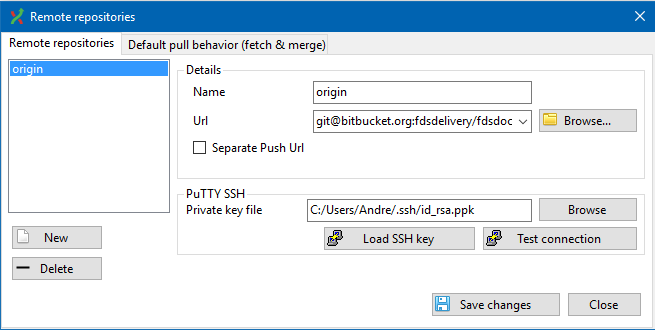
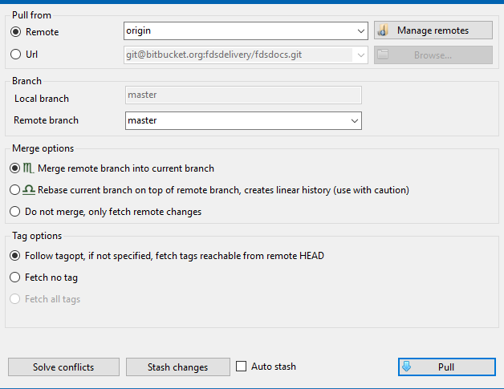

[TOC]

### Requirements

* The latest (full) version of [Git Extenstions](https://gitextensions.github.io/) is installed
* `git --version` shows no errors; if not, add the location of the __Git__ folder to the __PATH__
* There exists the `GIT_SSH` Windows environment variable (necessary for `plink`): `C:\Program Files (x86)\GitExtensions\PuTTY`
* `PuTTY` directory is on the system __PATH__: `C:\Program Files (x86)\GitExtensions\PuTTY`
* `where ssh` command shows the location of `ssh.exe`; if not, add the location of the `Git\usr\bin` folder to the system __PATH__

---

### Manage SSH keys on your local Windows machine

SSH keys are stored locally in `%USERPROFILE%/.ssh` directory. If it does not exist, create one.

#### Add a new SSH key via PUTTYGEN

* Open your command prompt and type `puttygen`. This will open the generator screen.
* Click `Generate` to generate a new key and move your mouse across the white area.
* Type in the passphrase (__remember it wel!__) and save the private key to `%USERPROFILE%\.ssh` directory as `id_rsa.ppk`.  

* Also, save the __OpenSSH__ version of the key as `id_rsa` file via the top menu `Conversions` -> `Export OpenSSH key`.

#### Add a new SSH key via SSH-KEYGEN

* Alternatively, you can generate the key via `ssh-keygen` command
* Save the key as `id_rsa` file in `.ssh` directory
* Open `puttygen` and load the generated key
* Save the corresponding private key as above for Puttygen

#### Add config file for SSH

* In your `.ssh` directory create an empty `config` textfile (no extension)
* For your remote host, e.g. BitBucket, add the configuration information. It will look something like this:
```none
    Host BITBUCKET
    Hostname bitbucket.org
    User your-user-name-on-bitbucket
    PubKeyAuthentication yes
    IdentityFile id_rsa
```

#### Test the connection

* run `ssh -T git@bitbucket.org`
* you may see something like this:
```none
    key_load_public: invalid format
    Enter passphrase for key '/c/Users/Andre/.ssh/id_rsa':
    logged in as Madrusnl.

    You can use git or hg to connect to Bitbucket. Shell access is disabled.
```
* you may ignore the `invalid format` error if you see the rest
* otherwise you can do some __troubleshooting__:
    * use `-vvv` option: `ssh -T git@bitbucket.org -vvv`
    * make sure you have registered your PUBLIC key (.pub) on the (BitBucket) server
    * make sure your `IdentiyFile` variable in the `config` file points to your PRIVATE key (without extension).

---

### How to clone the remote private repo via SSH

* make sure you have the private key for the remote repo in `.ssh` folder, e.g. `id_rsa.ppk` (otherwise create it as described hereabove)
* create the local folder to which you wish to clone the remote repo
* initialize the empty git repo in it by `git init`
* open the repo with __Git Extensions__
* in its menu, go to `Repository`, `Remote repositories...` and create a new remote repository. Call it `origin` (or any other name you like). 
* Copy the SSH url of the BitBucket repo and paste it in the `Url` field
* For the `PuTTY SSH` field, browse to the private key in `.ssh` directory and pick it up
    
* Click on `Load SSH key` and type in your passphrase for the private key
* Test connection with `Test connection`
* If everything is ok, save changes and close
* Click on the light blue down arrow, choose `Pull`, fill in the right remote branch, e.g. `master` and choose `Merge remote branch into current branch`
    
* Click the `Pull` button
* If everything went fine, you should now see the branch tree with all the commits
