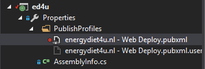

# Issues and solutions

[TOC]

### Bundling and minifying

Most of the information comes from [here](https://our.umbraco.org/forum/developers/razor/72069-how-to-bundle-css-and-js) and from [Bundling and minification in Umbraco](https://gist.github.com/jkarsrud/5143239).

*   Added `App_Start` folder
*   Created `BundleConfig.cs` class with bundles for JavaScript and CSS files
*   Added `BundleTable.EnableOptimizations = true;` in `BundleConfig.cs` to be able to test bundling and minification.
*   At the same time, added `<compilation debug="true" />` in `<system.web>` section of `Web.config`, `<compilation debug="false" />` in `web.Release.config`.

  **Important:** `EnableOptimizations` takes precedence of `compilation debug` value.

*   It is also important to make sure that `bundles` are included in the `umbracoReservedPaths`:

```xml
  <appSettings>
    ...
    <add key="umbracoReservedPaths" value="~/umbraco,~/install/,~/bundles/" />
    ...
  </appSettings>
```

### Web Deployment - Could not find part of the path

#### Question

Error during web deploy

> Could not open Source file: Could not find a part of the path 'J:\U\Ed4u\Ed4u\App_Plugins\LeBlender\Web.config;\App_Plugins\LeBlender\Web.config'.

#### Answer

Find the deployment profile `energydiet4u.nl - Web Deploy.pubxml`



and add the following key to the `PropertyGroup` section:

```xml
<AutoParameterizationWebConfigConnectionStrings>False</AutoParameterizationWebConfigConnectionStrings>
```

### Web Deployment - Group policy prevents Roslyn's csc.exe from running

#### Question

Website runtime error after deployment to GoDaddy:


#### Answer

Since the .NET 4.5 version, Roslyn compilation is the default way of compiling. This means if you create any web application either Web Forms or MVC using .NET 4.5 you get this Roslyn csc.exe compilation pre-installed in your project.

*   Uninstall `Microsoft.CodeDOM.Providers.DotNetCompilerPlatform` NuGet package, rebuild and redeploy the website
*   Delete the corresponding .dll's from the `bin` directory

**NOTE** This will be probably necessary to do every time **Umbraco** is upgraded.
